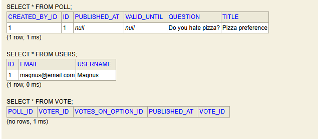
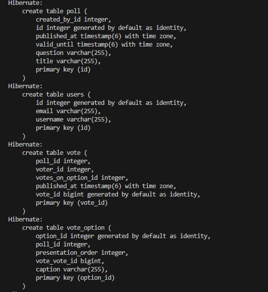

# Assignment 4: JPA persistence

For this assignment we added JPA through Hibernate to our project following test driven design where we had received a number of tests which needed to pass. This assignment for me was done in a rather quick way because I had already set up my java objects, like User/Poll/Vote to have real object references noting the bidirectional relationships and the mapping. From here it was a matter of setting up the specifics of the relationships, for instance Polls having a one-to-many relationship with Vote objects. 

I went a step further and changed some earlier implementation to get closer to a working product with the H2 in-memory database and got the basic Poll functionality working, although there's still some work to be done to get all the tests working here. The process, however, is not particularly painful and would be simple to complete. All the tests given for this assignment passed without problems. 

To do this I changed my PollManager class to hold repositories created for each of my objects instead of crude lists and made changes to methods. 
By starting the service and connecting it to the H2 database I could inspect the tables created. To get this to work I had to set the correct info within 
 `src\main\resources\application.properties`

 
I can see the basic tables for Polls/Users/Vote and the associations via foreign keys makes sense. The same can be seen by directly outputting the commands to console:

Overall, this went pretty smoothly and I'm looking forward to continuing the improvements for this codebase. 